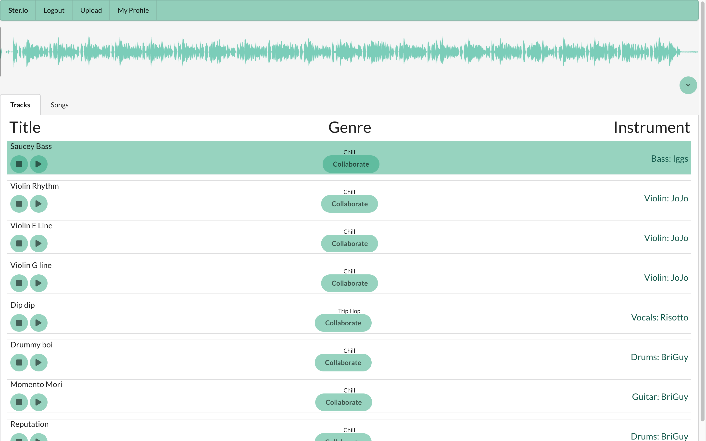
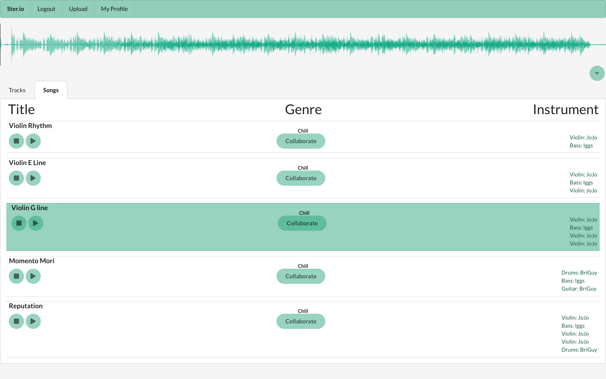
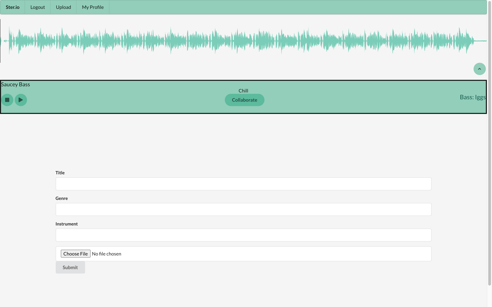
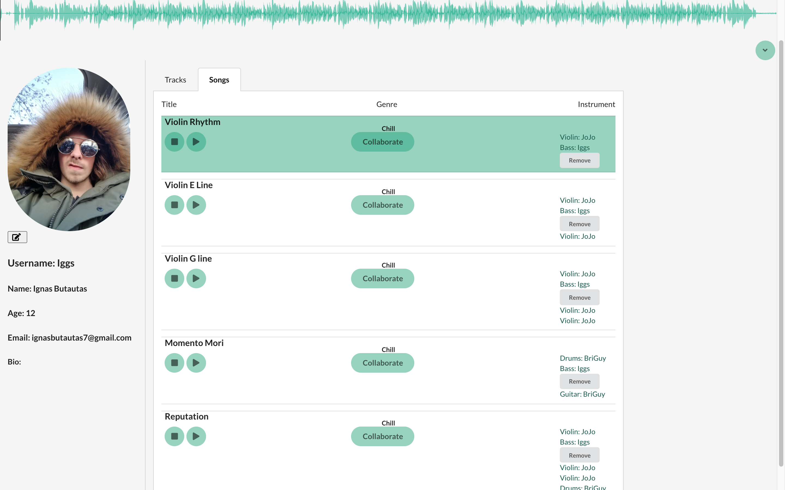

# Ster.io
# Create and Collaborate

________________________________________________________

## To install 
1. Open your terminal.
2. Git clone git@github.com:AnansiOmega/Ster.ioFrontEnd.git
3. Cd into sterio-frontend (case sensitive)
4. Open with code .
6. Run npm i && npm start
7. Make a profile and have fun!

________________________________________________________

## Getting started 
**1. Signup with a Username**

**2. Once Logged in, you will be redirected to the page that houses all of the tracks**

**Pressing on the Songs tab will show you all of the Songs the application has to offer**

**Hitting the Collaborate button will redirect you to the upload page where you will need to fill out a form with a new track you'd like to upload**

**There are also User Profile Pages! Here you can Browse other users tracks, and songs that they are a part of.**

**You can also make edits to your own account, as well as delete tracks.**

________________________________________________________
